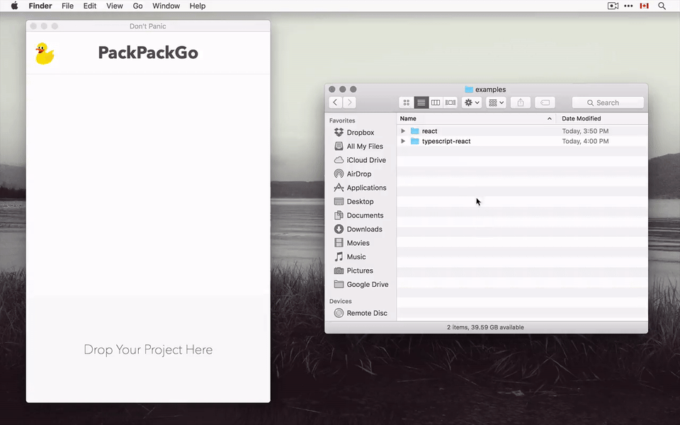

# PackPackGo

PackPackGo is a Webpack GUI that makes building your JavaScript project as easy as playing mp3.

Drop your project into PackPackGo, and click play. You project will build, and the browser will automatically refresh whenever you make new changes.



When you are done, click "bundle" for production release. You'll get a minified, transpiled, polyfilled bundle.

Pack it, and go!

# Getting Started

All you need is a single `index.js`:

```js
import * as React from "react";
import { render } from "react-dom";

window.addEventListener("load", () => {
	render(
		<div>Hello World</div>,
		document.getElementById("root")
	);
});
```

There is nothing to configure or install.

+ See: [React Example](examples/react)
+ See: [TypeScript Example](examples/react)

# Features

PackPackGo comes with its own Webpack configuration. It includes:

+ Source Map.
+ Live-reload with BrowserSync.
+ CSS module.
+ Less and SASS support.
+ CSS Autoprefix.
+ TypeScript support.

For production bundle:

+ Polyfill
+ Minification
+ ES3 transpilation with Babel